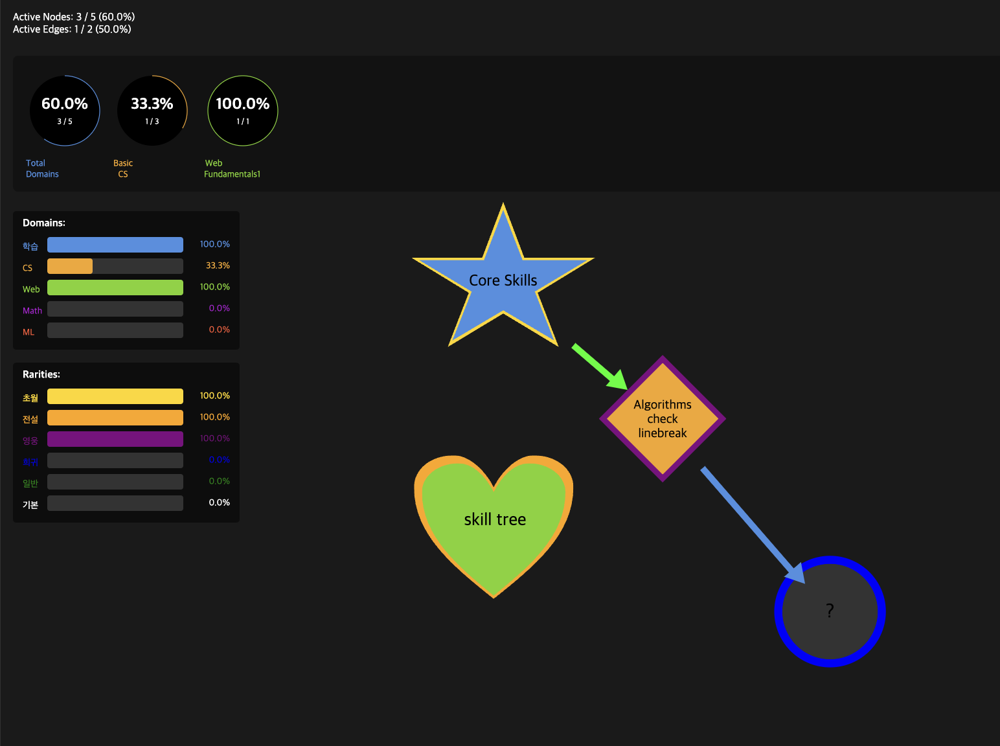
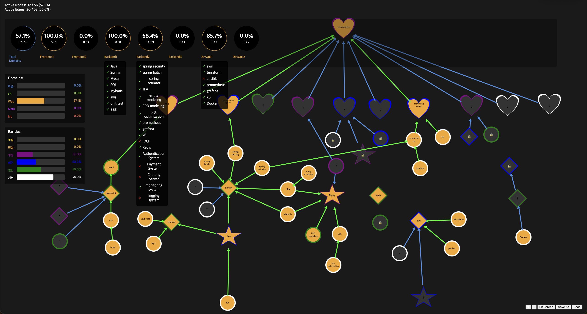

# A. what

skill tree in html + js + json

### ex) web developer

# B. features

1. graph view (node + edge)
2. double-click to create a new node
3. long-press to connect nodes
4. isolated nodes are visualized as locked, deactivated node with at least 1 connected activated node is visualized with "?"
5. categorize nodes by shape
6. categorize domain by color
7. categorize rarity by outline's color
8. visualize count # of active nodes / total nodes (same for domain / rarity)
9. visualize collection rates with bar/round gauge for domain / rarity
10. collections (toggle to see which nodes belongs to it, which are completed, which are not)
11. command(ctrl for window) + drag to select multiple nodes for drag
12. click an edge and backspace deletes the edge

